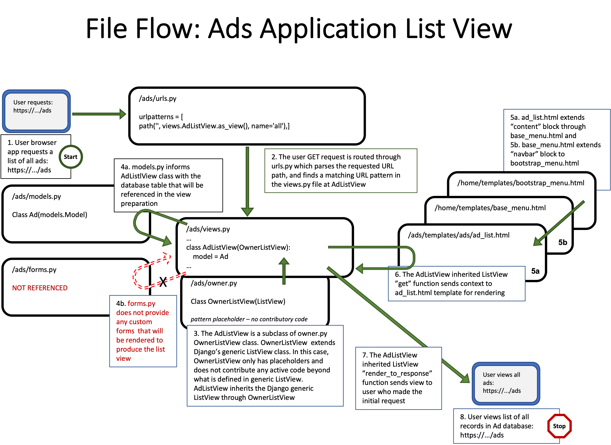
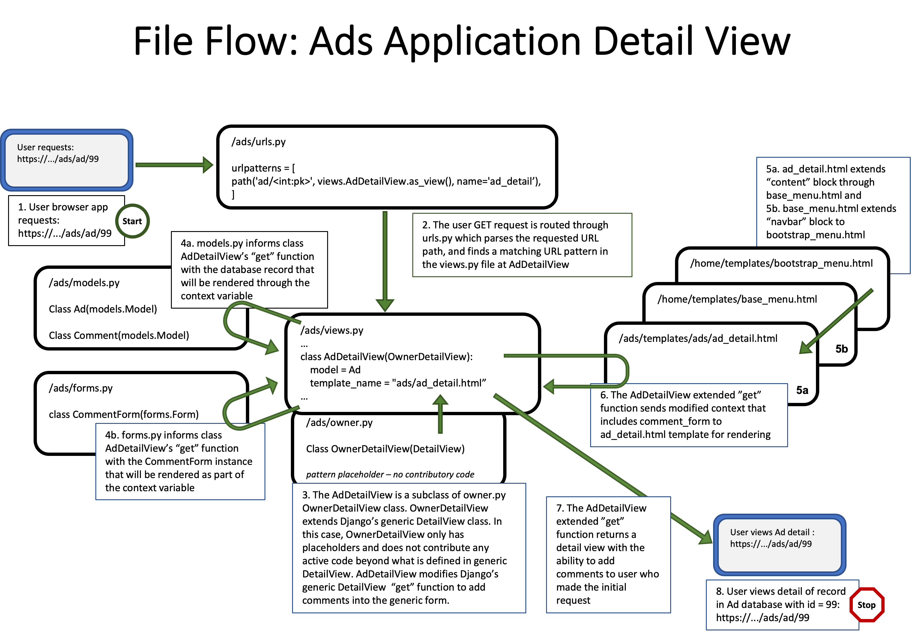
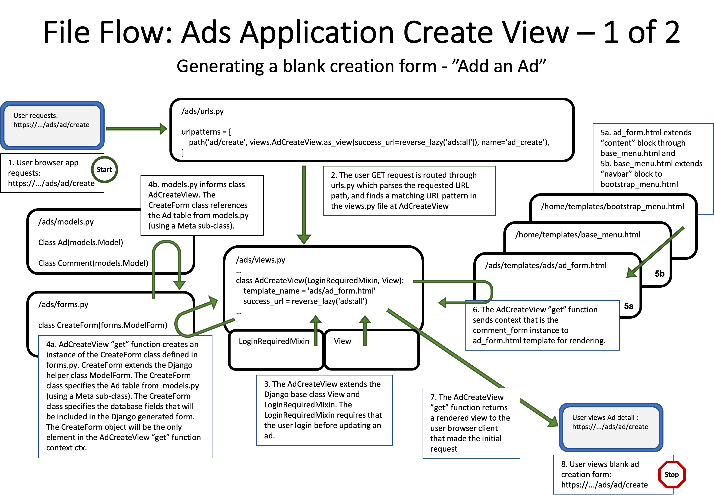
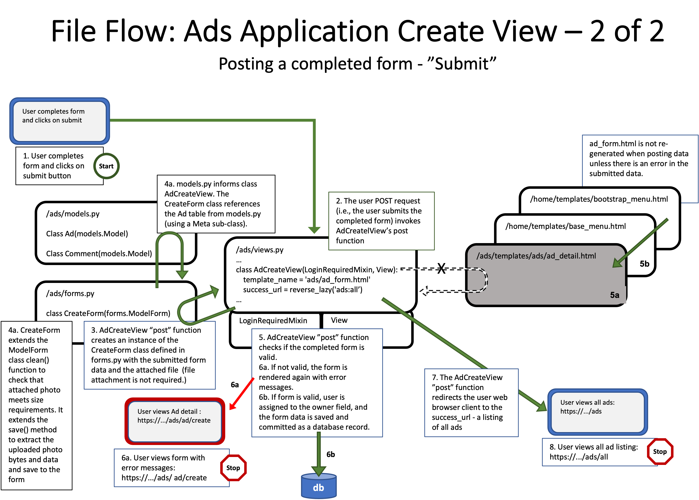
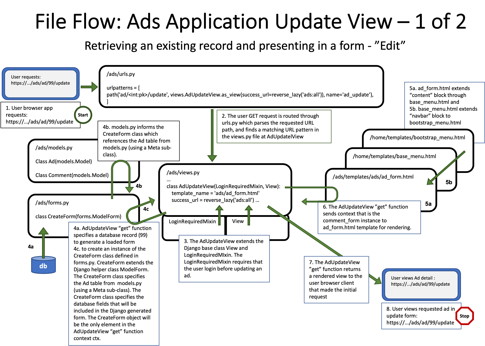
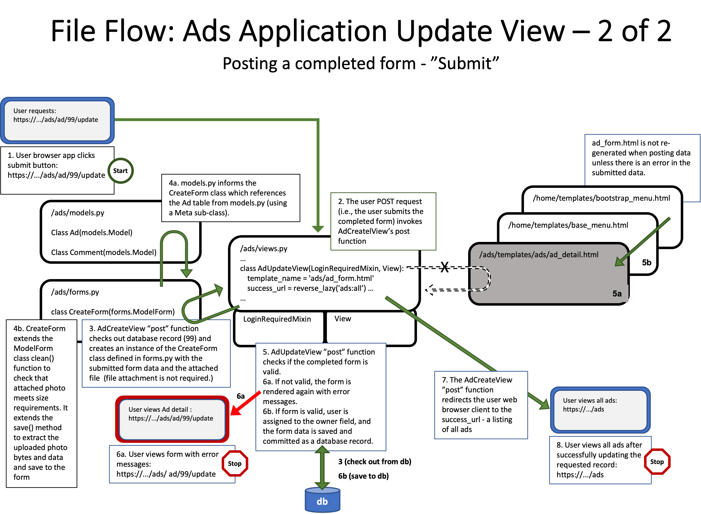
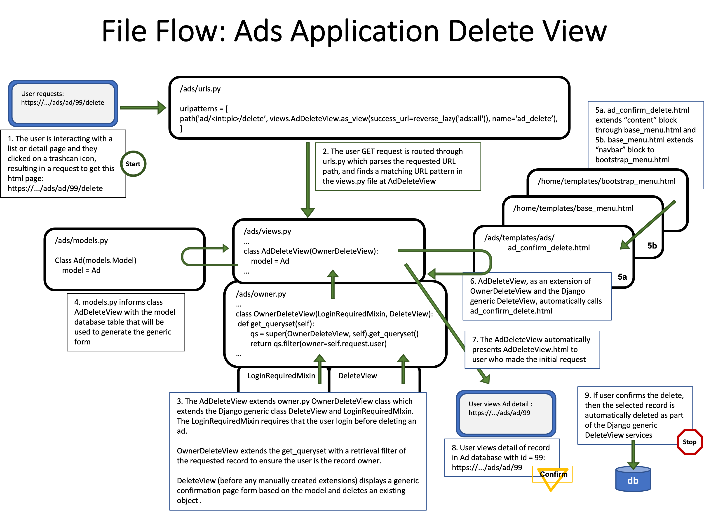

##### **Attribution:**  
- *This document contains my notes from the "Django for Everybody (DJ4E)" MOOC series created by Dr. Charles Severance, University of Michigan. The materials in the DJ4E courses are available under a Creative Commons License to allow for teachers to make use of these materials in their own courses.*  
- *The following notes contain images based on the DJ4E presentation slides, also created by Dr. Severance as course resources. The notes and images in this document were assembled by me as a learning aid to supplement the course content and as a reference for completing the course assignments and quizzes.*

*My notes represent my interpretation of the DJ4E course videos, transcripts and presentation slides.* ***Any content errors or omissions in these notes should be attributed to me, as the note-taker.***

# Django for Everybody

## Course #3: Django Features and Libraries

### Project Diagrams: Classified Ads with Owned Rows

#### File Flow for Classified Ads List View with Owned Rows

#### File Flow for Classified Ads Detail View with Owned Rows

#### File Flow for Classified Ads Create View (first of 2 images) with Owned Rows

#### File Flow for Classified Ads Create View (second of 2 images) with Owned Rows

#### File Flow for Classified Ads Update View (first of 2 images) with Owned Rows

#### File Flow for Classified Ads Update View (second of 2 images) with Owned Rows

#### File Flow for Classified Ads Delete View with Owned Rows

##### Postscript attributions:

*The Django for Everybody course and slides are Copyright 2019-  Charles R. Severance (www.dr-chuck.com) as part of www.dj4e.com and made available under a Creative Commons Attribution 4.0 License.  Please maintain this postscript in all copies of the document to comply with the attribution requirements of the license.  If you make a change, feel free to add your name and organization to the list of contributors on this page as you republish the materials.*

*Initial Development: Charles Severance, University of Michigan School of Information*

*Insert new Contributors and Translators here including names and dates:*  
*Tim Castle, January 2022*
