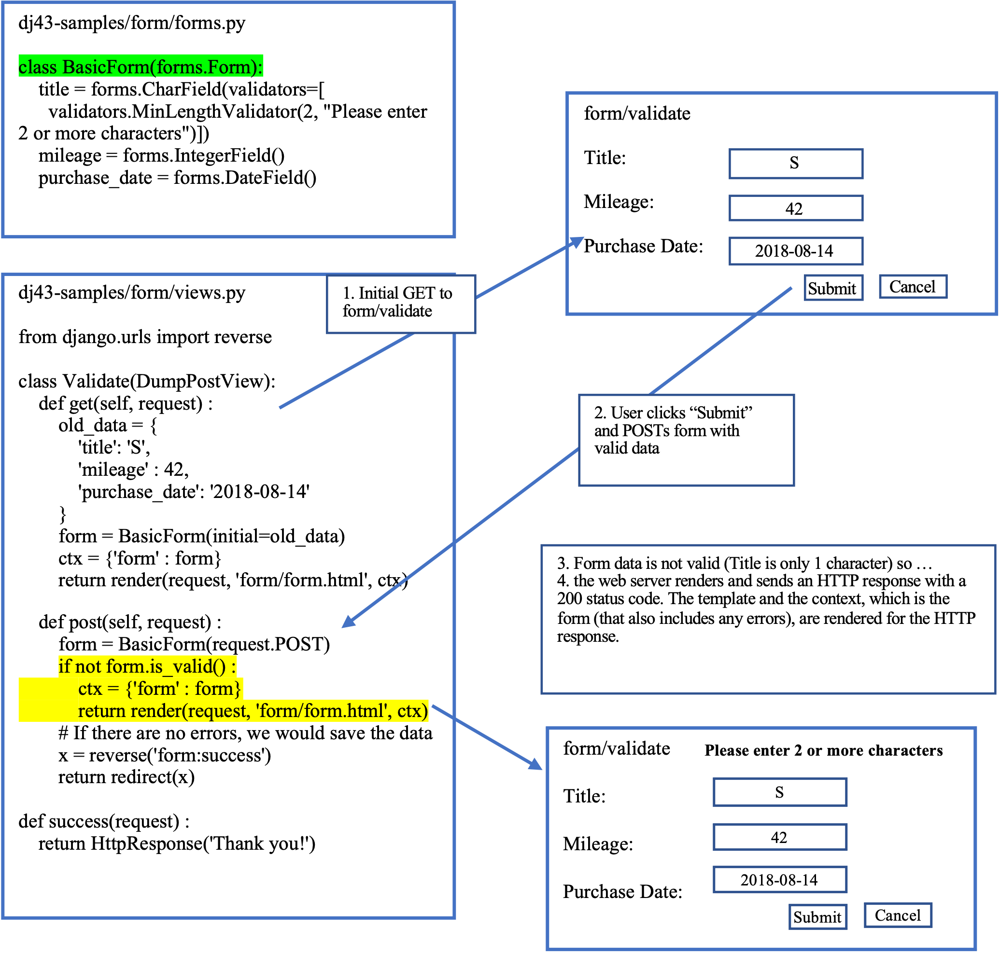

##### **Attribution:**  
- *This document contains my notes from the "Django for Everybody (DJ4E)" MOOC series created by Dr. Charles Severance, University of Michigan. The materials in the DJ4E courses are available under a Creative Commons License to allow for teachers to make use of these materials in their own courses.*  
- *The following notes contain images based on the DJ4E presentation slides, also created by Dr. Severance as course resources. The notes and images in this document were assembled by me as a learning aid to supplement the course content and as a reference for completing the course assignments and quizzes.*

*My notes represent my interpretation of the DJ4E course videos, transcripts and presentation slides.* ***Any content errors or omissions in these notes should be attributed to me, as the note-taker.***


# Django for Everybody

## Course #3: Django Features and Libraries

### Week 3 - Django Forms

#### Using Django Forms Capabilities

-	Django forms are part of the view function in the model-view-controller structure – they interact with `views.py` and with templates, and they interact with the data model.
-	By using Django forms, we are re-using hundreds of lines of code that produce user interfaces; validate user data entry into fields; receive the user provided data and interface with it to the data model in order to create, update, or delete table records; and respond to the user with success or error messages.
-	Django forms live in a file called `forms.py`.
    -	They resemble the models file in that they can specify fields with field types and can use validators to enforce rules about fields/attributes (e.g., field length).
    -	However, the form validators can be even more complex than the model rules and types. In addition, you can write code with functions that parse an inbound, completed form, and have multiple validation criteria (e.g., a particular field must have two uppercase characters followed by three lowercase characters.
-	In the next code snippets, we are going to create a view, in `views.py`, that uses a form, which is created in `forms.py`. This form is then inserted into a template through the use of the render method. The form is passed to the template as the context variable:

  
  - In the above example,
      -	the context, “ctx”, in the view, SimpleCreate, is the variable, “form”, which is an object of the BasicForm class that was defined in the forms.py file (1).
      -	the context, “ctx”, along with the template, dj43-samples/form/templates/form/form.html, is rendered and returned to the client (2).
-	In the next code snippets, we are going to create a view combined with a form and populated data:

  
  -	The form data, as “old_data” (a dictionary variable), is passed to the BasicForm constructor (1), and the form is pre-populated.
      -	A more common usage is to have the model pass the requested data to the form.


#### Data Validation with Django Forms

-	Data validation occurs after the user has entered their data and hit the submit button. At that point, the data validation is the actions by the web server to examine the data and determine whether the user has submitted erroneous data. If the data is erroneous, then the server returns to the user a form with the appropriate message. If the data is valid, then the server stores the data and sends a success message.
-	Here is the flow for a successful data validation using Django forms

-	Here is the flow if the user submitted data has errors. In this case the form is pre-populated with data where the “Title” is one character. The validation fails because the “Title” has to be at least two characters



#### Generic CreateView, UpdateView, DeleteView Django classes
##### From Week #3 Walkthrough: Samples – Autos

Documentation can be found at:
<https://docs.djangoproject.com/en/3.2/ref/class-based-views/generic-editing/>
from django.views.generic.edit import CreateView, UpdateView, DeleteView

-	`CreateView` is a Django generic class that creates a view that displays a form for creating an object, redisplaying the form with validation errors (if there are any) and saving the object.
    -	The following code snippet from a `views.py` file (for an app named “autos”) shows how to code a webpage that enables a user to create an automobile make (e.g. Subaru, GM, Toyota) record. The `MakeCreate` class inherits the Django `CreateView` generic class. It also inherits the `LoginRequiredMixin` class because we only allow authenticated, i.e., logged-in, users to create a new automobile make record.
        ```
        class MakeCreate(LoginRequiredMixin, CreateView):  # edited in week 3 assignment
            model = Make
            fields = '__all__'
            success_url = reverse_lazy('autos:all')
        ```
    -	**NOTE – important: The CreateView page displayed to a `GET` request uses a `template_name_suffix` of `_form`.** For example, changing this attribute to `_create_form` for a view creating objects for the example Author model would cause the default template_name to be `myapp/author_create_form.html`.
    -	In coordination with the `MakeCreate` class, we need to write a `/autos/templates/autos/make_form.html` that looks like the following:
        ```
        

        
          <form action="" method="post">
            
            <table>
            {{ form.as_table }}
            </table>
            <input type="submit" value="Submit">
            <input type="submit" onclick="window.location='' ; return false;" value="Cancel">
          </form>
        
        ```
-	`UpdateView` is a Django generic class that creates a view that displays a form for editing an existing object, redisplaying the form with validation errors (if there are any) and saving changes to the object. This uses a form automatically generated from the object’s model class (unless a form class is manually specified).
    -	The following code snippet from a `views.py` file (for an app named “autos”) shows how to code a webpage that enables a user to update an automobile make (e.g. Subaru, GM, Toyota) record. The `MakeUpdate` class inherits the Django `UpdateView` generic class. It also inherits the `LoginRequiredMixin` class because we only allow authenticated, i.e., logged-in, users to update an existing automobile make record.
        ```
        class MakeUpdate(LoginRequiredMixin, UpdateView):
            model = Make
            fields = '__all__'
            success_url = reverse_lazy('autos:all')
        ```
    -	**NOTE – important: The UpdateView page displayed to a `GET` request uses a `template_name_suffix` of `_form`.** For example, changing this attribute to `_update_form` for a view updating objects for the example Author model would cause the default template_name to be `myapp/author_update_form.html`.
        -	Where do we update the `template_name_suffix`? In the following example, it looks like `template_name_suffix` = `_list`. How and where was this coded?
    -	In coordination with the `MakeCreate` class, we need to write a `/autos/templates/autos/make_list.html` that looks like the following:
        ```
        

        
          <h1>Make List</h1>
          
          <ul>
            
              <li>
                  {{ make.name }}
                 (<a href="">Update</a> |
                  <a href="">Delete</a>)
              </li>
            
          </ul>
          
            <p>There are no makes in the library.</p>
          
          <p><a href="">Add a make</a></p>
          <p>
            <a href="">Back to autos</a>
          </p>
        
        ```
-	`DeleteView` is a Django generic class that creates a view that displays a confirmation page and deletes an existing object. The given object will only be deleted if the request method is `POST`. If this view is fetched via `GET`, it will display a confirmation page that should contain a form that POSTs to the same URL.
    -	The following code snippet from a `views.py` file (for an app named “autos”) shows how to code a webpage that enables a user to delete an automobile make (e.g. Subaru, GM, Toyota) record. The `MakeDelete` class inherits the Django `DeleteView` generic class. It also inherits the `LoginRequiredMixin` class because we only allow authenticated, i.e., logged-in, users to delete an existing automobile make record.
        ```
        class MakeDelete(LoginRequiredMixin, DeleteView):
            model = Make
            fields = '__all__'
            success_url = reverse_lazy('autos:all')
        ```
    -	**NOTE – important: The `DeleteView` page displayed to a `GET` request uses a `template_name_suffix` of `_confirm_delete`.** For example, changing this attribute to `_check_delete` for a view deleting objects for the example Author model would cause the default template_name to be `myapp/author_check_delete.html`.
    -	In coordination with the `MakeDelete` class, we need to write a `/autos/templates/autos/make_confirm_delete.html` that looks like the following:
        ```
        

        

        <h1>Delete Make</h1>

        <p>Are you sure you want to delete the make: {{ make }}?</p>

        <form action="" method="POST">
          
          <input type="submit" value="Yes, delete.">
          <input type="submit" onclick="window.location='' ; return false;" value="Cancel">
        </form>

        
        ```


##### Postscript attributions:

*The Django for Everybody course and slides are Copyright 2019-  Charles R. Severance (www.dr-chuck.com) as part of www.dj4e.com and made available under a Creative Commons Attribution 4.0 License.  Please maintain this postscript in all copies of the document to comply with the attribution requirements of the license.  If you make a change, feel free to add your name and organization to the list of contributors on this page as you republish the materials.*

*Initial Development: Charles Severance, University of Michigan School of Information*

*Insert new Contributors and Translators here including names and dates:*  
*Tim Castle, January 2022*
