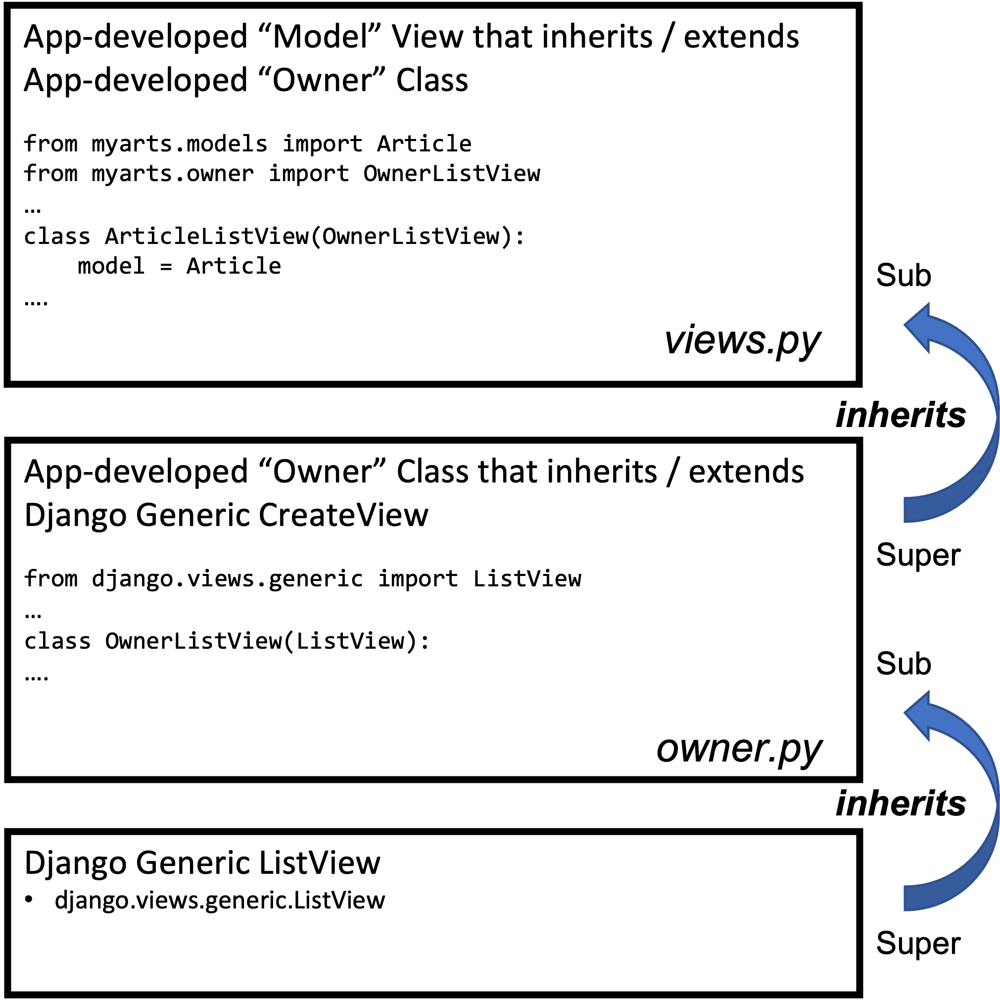
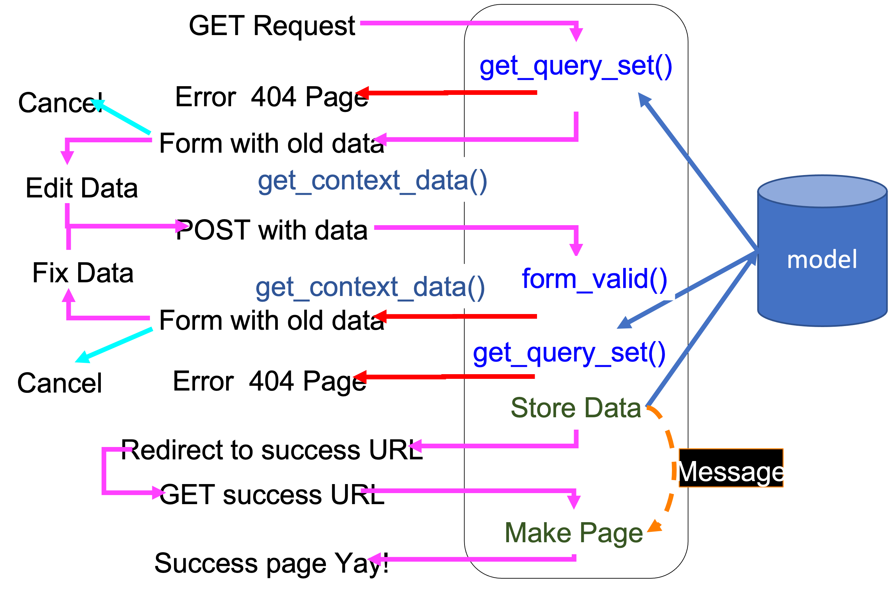
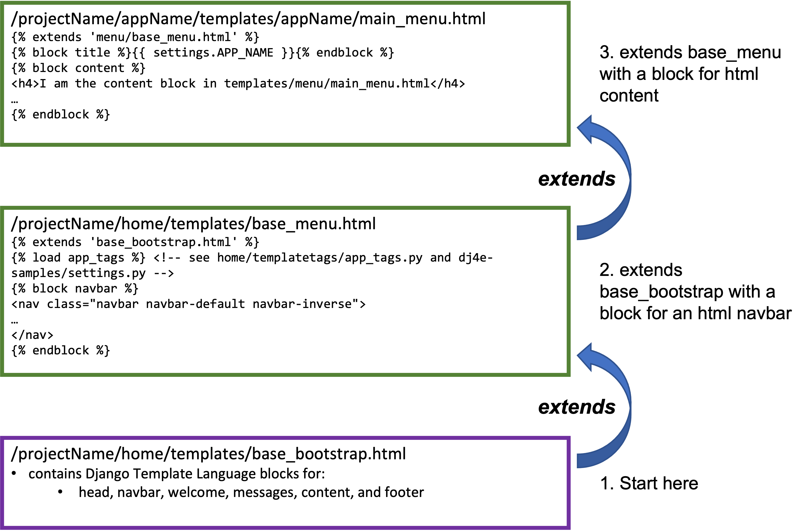

##### **Attribution:**  
- *This document contains my notes from the "Django for Everybody (DJ4E)" MOOC series created by Dr. Charles Severance, University of Michigan. The materials in the DJ4E courses are available under a Creative Commons License to allow for teachers to make use of these materials in their own courses.*  
- *The following notes contain images based on the DJ4E presentation slides, also created by Dr. Severance as course resources. The notes and images in this document were assembled by me as a learning aid to supplement the course content and as a reference for completing the course assignments and quizzes.*

*My notes represent my interpretation of the DJ4E course videos, transcripts and presentation slides.* ***Any content errors or omissions in these notes should be attributed to me, as the note-taker.***


# Django for Everybody

## Course #3: Django Features and Libraries

### Week 5 - Owned Rows

#### Owned Rows in Django - Overview

Owned Rows: In the database model, we specify the owner of a row of data; and in the web application we create views so that only owners are offered the option to edit or delete. All users are allowed to view records. Furthermore, we have to provide security in the application to enforce the restriction that a non-owner cannot edit or delete a row.
-	To create owned rows, we will use object-oriented inheritance.
    -	Recall: ‘Subclasses’ are more specialized versions of a class, which inherit attributes and behaviors from their parent classes, and can introduce their own.  

-	We will develop a class that inherits a Django, generic view class.
    -	E.g., Django generic `ListView` is the parent (or super) class
    -	`OwnerListView(ListView)` is created by the app developer inside the `owner.py` file and inherits from the Django generic `ListView` class.
    -	`ArticleListView(OwnerListView)` is created by an application developer inside the `views.py` file. It inherits the developer-defined `OwnerListView` class – `ArticleListView` is the child (or sub-class) to the `OwnerListView` class. It “informs” `OwnerListView` by adding the specification that `model = Article`.    

      

#### Owned Rows in Django – Generic Views Review

Owned Rows in Django – Generic Views Review

When we inherit the Django Generic views, we can add code to our sub class that modifies existing or introduces new behaviors and attributes to the super class from which we inherit.
-	From the Django documentation, we can get a flow chart of the methods used in Generic classes.
    -	For example, the generic class `ListView` has the following flowchart of methods:
      1.	`setup()`
      2.	`dispatch()`
      3.	`http_method_not_allowed()`
      4.	`get_template_names()`
      5.	`get_queryset()`
      6.	`get_context_object_name()`
      7.	`get_context_data()`
      8.	`get()`
      9.	`render_to_response()`
    -	The method flow used in the generic class `UpdateView` can be mapped to the following flow diagram:
    

    - We can inherit all the methods (behaviors) in the `ListView` or `UpdateView` or `CreateView` or any of the generic classes and, additionally, write our own versions of the methods to modify their behaviors. This is called “extending” the behavior of the inherited class.
    -	In modifying the behaviors of an inherited class, we can either:
        -	completely replace a method in the parent class, or
        -	augment a method in the parent class.
    -	Specifically, to create an “owned” view, we will extend – i.e., write our own modified versions of –  the `get_query_set()` method from the `UpdateView` class and the `form_valid()` method from the `CreateView` class.    


#### Owned Rows in Django – owner.py

##### Pattern:    

Here are the steps for creating an owned row in Django:    
-	First, we create the model in `models.py`:    
    -	`/projectName/appName/models.py`, e.g.,
    -	`/dj4e-samples/myarts/models.py`
        ```
        from django.db import models
        from django.core.validators import MinLengthValidator
        from django.contrib.auth.models import User
        from django.conf import settings

        class Article(models.Model):
            title = models.CharField(
                    max_length=200,
                    validators=[MinLengthValidator(2, "Title must be greater than 2 characters")]
            )
            text = models.TextField()
            owner = models.ForeignKey(settings.AUTH_USER_MODEL, on_delete=models.CASCADE)
            created_at = models.DateTimeField(auto_now_add=True)
            updated_at = models.DateTimeField(auto_now=True)

            # Shows up in the admin list
            def __str__(self):
                return self.title
        ```
    -	This table links to an external table that belongs to Django (i.e., table that Django defines for us)
        -	This is specifically done in this line of the `models.py` file:
            ```
            owner = models.ForeignKey(settings.AUTH_USER_MODEL, on_delete=models.CASCADE)
            ```
-	Second, we define the views in views.py:
    -	`/projectName/appName/views.py`, e.g.,
    -	`/dj4e-samples/myarts/views.py`
        ```
        from myarts.models import Article
        from myarts.owner import OwnerListView, OwnerDetailView, OwnerCreateView, OwnerUpdateView, OwnerDeleteView

        class ArticleListView(OwnerListView):
            model = Article
            # By convention:
            # template_name = "myarts/article_list.html"

        class ArticleDetailView(OwnerDetailView):
            model = Article

        class ArticleCreateView(OwnerCreateView):
            model = Article
            fields = ['title', 'text']

        class ArticleUpdateView(OwnerUpdateView):
            model = Article
            fields = ['title', 'text']

        class ArticleDeleteView(OwnerDeleteView):
            model = Article
        ```
    -	Note, in the next step we will create an `owner.py` file for our app that creates classes that inherit from the Django generic views (`ListView`, `CreateView`, etc.), so we need the following line in the `views.py` file
        -	from `myarts.owner` import `OwnerListView`, `OwnerDetailView`, `OwnerCreateView`, `OwnerUpdateView`, `OwnerDeleteView`
    -	Keep in mind that the `views.py` classes consider: 1. what is referenced from the database and 2. what appears on the screen.
    -	In the view classes, we specify the model that we are referencing:
        -	`model = Article`
    -	We also need to specify how we want the form to appear, so we have a line specifying the displayed fields:
        -	`fields = ['title', 'text']`
        -	For the `ArticleCreateView()` and `ArticleUpdateView()` classes, we are specifying that the form to be displayed will have two fields: “title” and “text” – the “owner” field is purposefully omitted (along with the “created_at” and “updated_at” fields)

-	Third, we extend the Django generic views in owner.py:
  -	`/projectName/appName/owner.py`, e.g.,
  -	`/dj4e-samples/myarts/owner.py`
        ```
        from django.views.generic import CreateView, UpdateView, DeleteView, ListView, DetailView

        from django.contrib.auth.mixins import LoginRequiredMixin

        class OwnerListView(ListView):
            """
            Sub-class the ListView to pass the request to the form.
            """

        class OwnerDetailView(DetailView):
            """
            Sub-class the DetailView to pass the request to the form.
            """

        class OwnerCreateView(LoginRequiredMixin, CreateView):
            """
            Sub-class of the CreateView to automatically pass the Request to the Form
            and add the owner to the saved object.
            """
            # Saves the form instance, sets the current object for the view, and redirects to get_success_url().
            def form_valid(self, form):
                # print('form_valid called')
                object = form.save(commit=False)
                object.owner = self.request.user
                object.save()
                return super(OwnerCreateView, self).form_valid(form)

        class OwnerUpdateView(LoginRequiredMixin, UpdateView):
            """
            Sub-class the UpdateView to pass the request to the form and limit the
            queryset to the requesting user.
            """

            def get_queryset(self):
                # print('update get_queryset called')
                """ Limit a User to only modifying their own data. """
                qs = super(OwnerUpdateView, self).get_queryset()
                return qs.filter(owner=self.request.user)

        class OwnerDeleteView(LoginRequiredMixin, DeleteView):
            """
            Sub-class the DeleteView to restrict a User from deleting other
            user's data.
            """

            def get_queryset(self):
                print('delete get_queryset called')
                qs = super(OwnerDeleteView, self).get_queryset()
                return qs.filter(owner=self.request.user)
        ```
    -	`OwnerUpdateView()` Notes:
        -	In this class we inherit the Django generic view, `UpdateView()`, and augment its `get_queryset()` method
        -	class `OwnerUpdateView(LoginRequiredMixin, UpdateView)` is a guardian pattern that ensures a user is logged into the application  (by specifying `LoginRequiredMixin`) before we allow them to even attempt to edit a data set.
        -	By using `super`, we are specifying that the variable `qs` get loaded using the parent version (i.e., Django generic version) of `get_queryset()`
            -	`qs = super(OwnerUpdateView, self).get_queryset()`
        -	We are returning `qs` after first filtering to ensure that the record(s) owner is the user – otherwise the user will get a 404 error
            -	`return qs.filter(owner=self.request.user)`
        -	These notes for `OwnerUpdateView()` also apply to `OwnerDetailView()` – the same pattern is followed in both classes.
    -	`OwnerCreateView()` Notes
        -	In this class we inherit the Django generic view, `CreateView()`, and augment its `form_valid()` method
        -	The generic `form_valid()` method in the Django generic `CreateView()` looks at the data in a form, and makes sure that the data follows the rules for each field – e.g., field type, length or size, any developer defined criteria.
        -	In order to create an owned record/row in the database, the `OwnerCreateView()` must note the user who is requesting the new record, and assign them to the owner field. We do this while the form is being validated – i.e., we modify the form_valid() generic method as follows.
            -	The line, `object = form.save(commit=False)` , saves the form with its content to the variable `object`
            -	The line, `object.owner = self.request.user` , adds the `owner` field into the variable `object` and form (which both point to the same object?)
            -	Then we save the form with `object.save()`
            -	And finally we call on the parent/super version of `form_valid()` using the parent `CreateView()` class and return:
                -	`return super(OwnerCreateView, self).form_valid(form)`
    -	`OwnerListView()` and `OwnerDetailView()` Notes:
        -	These are just placeholder classes – they don’t have any code (methods or attributes) because owned rows don’t apply to them. Anyone -- owners and non-owners -- is allowed to read a list of records or a detailed record.
-	Fourth, we create the HTML templates for the extended generic views:
    -	The HTML template files are created and stored in `/projectName/appName/templates/appName` using the following naming convention:
        -	`modelName_confirm_delete.html`
            -	e.g.: `ad_confirm_delete.html`
        -	`modelName_detail.html`
            -	e.g.: `ad_detail.html`
        -	`modelName_form.html`
            -	e.g.: `ad_form.html`
        -	`modelName_list.html`
            -	e.g.: `ad_list.html`


#### Walkthrough: DJ4E Crispy Forms (crispy) Sample Code

Crispy forms provide improved formatting and styling for a form within a Django webpage app.

Here are the steps to applying Crispy forms:

-	**First**, when setting up your virtual python environment
    -	Edit a `requirements.txt` file to include latest version of  `django-crispy-forms`
    -	The file will reside in the project folder, e.g. `/dj4e-sample`s or `/projName`
        ```
        # To activate this run
        #
        # pip install -r requirements.txt
        # python -m django --version
        #
        # On a Macintosh this should be python3 and pip3
        #
        Django>=3.1.4
        django-crispy-forms>=1.8.1
        django-filter>=2.2.0
        djangorestframework>=3.10.3
        Markdown>=3.0.1
        social-auth-app-django>=3.1.0
        social-auth-core>=3.3.3
        django-extensions>=2.2.5
        django-taggit>=1.3.0
        mysqlclient>=1.4.6
        ```
    -	While in your Django virtual environment,
        -	`workon django3`
    -	and located at the project folder that contains `requirements.txt`,
        -	`cd /projName`
    -	run `pip`, python’s package manager, to read `requirements.txt` and get the latest version of  `django-crispy-forms`
        -	`pip install -r requirements.txt`
-	**Second**, in `settings.py`
    -	add an extension for `crispy_forms` in the `settings.py` file
        ```
        INSTALLED_APPS = [
            'django.contrib.admin',
            'django.contrib.auth',
            …

            # Extensions - installed with pip3 / requirements.txt
            'django_extensions',
            'crispy_forms',  
            …
        ]
        ….
        ```
-	**Third**, in `views.py`:
    -	Make a class in the `views.py` file that extends `View()`,
    -	Set the attribute variable `template_name = none` -- you will set the template name in `urls.py`.
        ```
        from django.views import View
        …
        class MyView(View):
            template_name = None # so we can override in urls.py
        ….
        ```
-	**Fourth**, in `urls.py`:
    -	Set `template_name` to html templates in which Crispy will be applied.
    -	Note: in the following example, the appName is “crispy” but it could be any name for an app – the use of “crispy” here is not a requirement of the pattern.
        ```
        from django.urls import path
        from . import views
        from django.views.generic import TemplateView

        # https://docs.djangoproject.com/en/3.0/topics/http/urls/
        app_name='crispy'
        urlpatterns = [
            path('', TemplateView.as_view(template_name='crispy/main.html'), name="main"),
            path('boring', views.MyView.as_view(template_name='crispy/boring.html')),
            path('awesome', views.MyView.as_view(template_name='crispy/awesome.html')),
        ]
        ```
-	**Fifth**, in the forms that use crispy.
    -	we load the `crispy_form_tags` to activate Crispy
    -	and then, we apply the Crispy filter to the table – this runs Crispy code to render the table with all the html/css styling
        -	If we hadn’t applied crispy, then we would have had some boring styling using the Django Template Language line {{ `form.as_table` }}
              ```
              
              DJ4E Crispy Forms
              
              <h1>This is a crispy (a.k.a awesome) form</h1>
              
              
              <p>
                <!-- see INSTALLED_APPS in dj4e-samples/settings.py -->
                
                <form action="" method="post">
                  
                  {{ form|crispy }}
                  <input type="submit" value="Submit">
                  <input type="submit"
                     onclick="window.location=''; return false;" value="Cancel">
                </form>
              </p>
              
              ```

#### Walkthrough: DJ4E Bootstrap Menu (menu) Sample Code

We can inherit or extend html template files using Django Template Language
-	As the basis of all our HTML templates, we can start with `/projectName/appName/home/template/base_bootstrap.html` file
  -	We can place the file in any folder with any name, as long as we use the correct path and name to reference it
  -	However, the naming convention above, can help organize the app’s file structure



**App Tags:** We can create our own app tags that are recognized by Django Template Language in our template files.
-	app tags are tags that we, as developers, can create and then we can do things in it.
-	Create an app tag python file and load your code – like displaying a gravatar on your webpage nav bar
-	The file with your app tags can be named anything and placed anywhere, as long as you reference the correct path and name, however, the following convention works well:
    -	/projectName /home/templatetags/app_tags.py
-	/dj4e_samples/home/templatetags/app_tags.py
      ```
      from hashlib import md5
      from django import template

      # https://brobin.me/blog/2016/07/super-simple-django-gravatar/

      # A "gravatar" is a globally recognized avatar that is based on email address
      # People must register their email address and then upload a gravatar
      # If an email address has no gravatar, a generic image is put in its place

      # To use the gravatar filter in a template include
      # 

      register = template.Library()

      @register.filter(name='gravatar')
      def gravatar(user, size=35):
          email = str(user.email.strip().lower()).encode('utf-8')
          email_hash = md5(email).hexdigest()
          url = "//www.gravatar.com/avatar/{0}?s={1}&d=identicon&r=PG"
          return url.format(email_hash, size)
      ```
-	In our template file we must include:
    -	
-	And, then in the file we can reference the “gravatar” function that we wrote in the app_tags.py file:
      ```
      <ul class="nav navbar-nav navbar-right">
            
            <li class="dropdown">
            <!-- gravatar depends on app_tags being loaded -->
            <!-- https://brobin.me/blog/2016/07/super-simple-django-gravatar/ -->
            <a href="#" data-toggle="dropdown" class="dropdown-toggle">
              <b class="caret"></b></a>
              <ul class="dropdown-menu">
                  <li><a href="?next=">Logout</a></li>
              </ul>
             </li>
             
             <li><a href="?next=">Login</a></li>
             
          </ul>
      ```


##### Postscript attributions:

*The Django for Everybody course and slides are Copyright 2019-  Charles R. Severance (www.dr-chuck.com) as part of www.dj4e.com and made available under a Creative Commons Attribution 4.0 License.  Please maintain this postscript in all copies of the document to comply with the attribution requirements of the license.  If you make a change, feel free to add your name and organization to the list of contributors on this page as you republish the materials.*

*Initial Development: Charles Severance, University of Michigan School of Information*

*Insert new Contributors and Translators here including names and dates:*  
*Tim Castle, January 2022*
