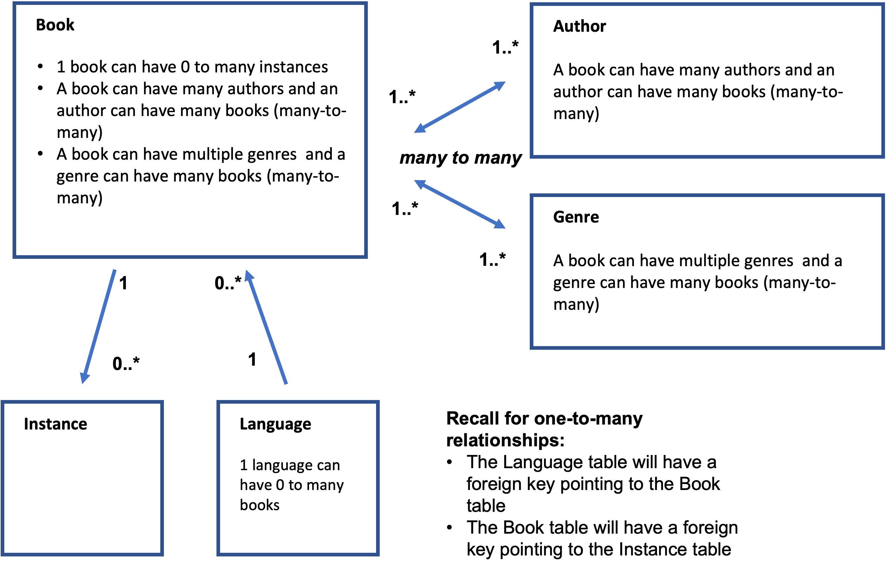
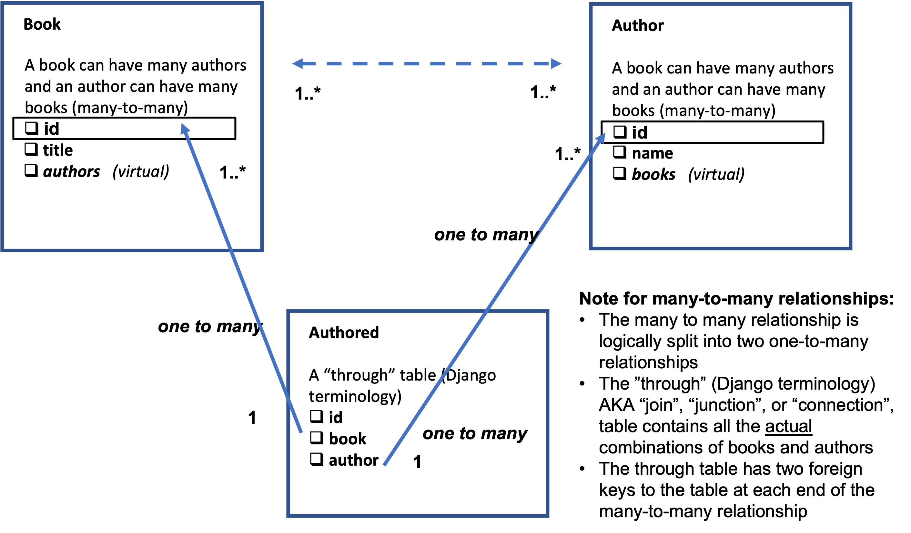
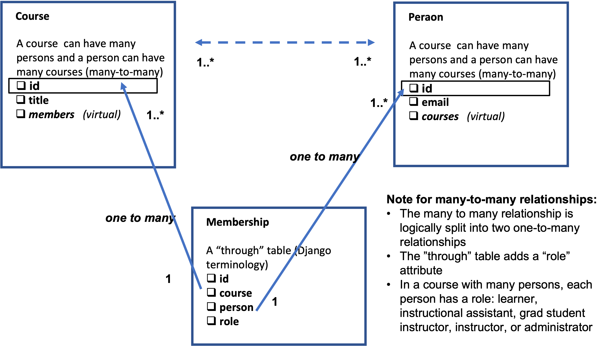

##### **Attribution:**  
- *This document contains my notes from the "Django for Everybody (DJ4E)" MOOC series created by Dr. Charles Severance, University of Michigan. The materials in the DJ4E courses are available under a Creative Commons License to allow for teachers to make use of these materials in their own courses.*  
- *The following notes contain images based on the DJ4E presentation slides, also created by Dr. Severance as course resources. The notes and images in this document were assembled by me as a learning aid to supplement the course content and as a reference for completing the course assignments and quizzes.*

*My notes represent my interpretation of the DJ4E course videos, transcripts and presentation slides.* ***Any content errors or omissions in these notes should be attributed to me, as the note-taker.***


# Django for Everybody

## Course #3: Django Features and Libraries

### Week 6 - Many-to-Many Models

#### Many-to-Many - Overview

Up until this point, we have been looking at data models where tables have a one-to-many relationship. Now we will look at database models which have tables that have a many-to-many relationship.

For example:


#### A Simple Many-To-Many Example in Django

We cannot directly create a many-to-many relationship within a relational database, so it is instead portrayed as two one-to-many relationships.
-	This is something that can be portrayed in a Django model
-	Django allows us to create a “through” (AKA “join” or “junction” or “connection” or “bridge”) table between the two ends of the many-to-many table relationship.
-	The “through” table has two outbound foreign keys with each pointing to one of the two ends of the many-to-many relationship.
-	In the example below, “Authored” is the “through” table and it has a foreign key that points to the table “Book” (specifically to its auto-incrementing “id” attribute field) and a foreign key that points to the table “Author” (also to its auto-incrementing “id” attribute).    


-	Django creates a virtual field which it will compute upon request - in the example above, “authors” is the virtual attribute of the Book table and it will contain all the authors of a given book. Likewise, “books” is a virtual attribute of the Author table and contains all the books associated with one author.
-	By default, Django will effectively “hide” the through table from the developer. However, you can override this and name and define the through table in your data model – which is what happens in the example below.
-	Example: `/dj4e-samples/bookmany/models.py`
    ```
    from django.db import models

    class Book(models.Model):
        title = models.CharField(max_length=200)
        authors = models.ManyToManyField('Author', through='Authored')

    class Author(models.Model):
        name = models.CharField(max_length=200)
        books = models.ManyToManyField('Book', through='Authored')

    class Authored(models.Model):
        book = models.ForeignKey(Book, on_delete=models.CASCADE)
        author = models.ForeignKey(Author, on_delete=models.CASCADE)
    ```
    -	The tables Book and Author have a many-to-many relationship …
    -	… and, the model is built with Authored as the through table.
    -	In the Book table, the attribute “authors” is a many-to-many link to the Author table and it is connected via the virtual through table Authored.
        -	The attribute “authors” is not data that's stored in each row of the Book table. Rather, it is data which is derived for you if you request it when you retrieve a book – basically, asking ''Who are the authors of this book?''
        -	Note that the Book table uses “authors” to point to the through table, and the Authored through table has a foreign key pointing right back to the Book table.
        -	Also note that the “author” attribute in the Authored through table performs “on delete cascade” – this means Django will clean up this through table if rows, (e.g., an Author or a Book record) are deleted from the “outside to” table (i.e., an Author or Book table record).

#### Many-To-Many Data Models for Courses and Membership

One pattern of a “through” table is the “member” table. A member through table adds a role to each many to many relationship.
-	In this example, educational systems are modeled where we have a many-to-many relationship between people and courses.
-	A course can have many people and a person can be in many courses.
-	However, people have roles within that many-to-many relationship: some people are students, others are teachers, and other people are administrators.    


-	In Django, the `/dj4e-samples/many/models.py` file looks like:
      ```
      from django.db import models

      class Person(models.Model):
          email = models.CharField(max_length=128, unique=True)
          name = models.CharField(max_length=128, null=True)
          courses = models.ManyToManyField('Course', through='Membership')

          def __str__(self):
              return self.email

      class Course(models.Model):
          title = models.CharField(max_length=128, unique=True)
          members = models.ManyToManyField('Person', through='Membership')

          def __str__(self):
              return self.title

      class Membership(models.Model):
          person = models.ForeignKey(Person, on_delete=models.CASCADE)
          course = models.ForeignKey(Course, on_delete=models.CASCADE)

          LEARNER = 1
          IA = 1000
          GSI = 2000
          INSTRUCTOR = 5000
          ADMIN = 10000

          MEMBER_CHOICES = (
              ( LEARNER, 'Learner'),
              ( IA, 'Instructional Assistant' ),
              ( GSI, 'Grad Student Instructor' ),
              ( INSTRUCTOR, 'Instructor' ),
              ( ADMIN, 'Administrator' ),
          )

          role = models.IntegerField(
              choices=MEMBER_CHOICES,
              default=LEARNER,
          )

          def __str__(self):
              return "Person "+ str(self.person.id) + " <--> Course " + str(self.course.id)
      ```
-	The Course and Person tables have a many-to-many relationship, and their Django data model is like the previous example
-	The Membership table is a variation on the earlier example, but it is an often-used pattern
    -	In the Membership table, the developer created a set of integers and associated those integers with meaning so they could be used in the admin interface.
    -	The “role” attribute in the Membership table is defined as an integer for efficient storage and fast retrieval performance.
          ```
          role = models.IntegerField(
              choices=MEMBER_CHOICES,
              default=LEARNER,
          )
          ```
    -	However, “role” has to be an integer from the list `MEMBER_CHOICES`. If an integer number is not provided for the record, then its default value will be 1 (`LEARNER=1`).

#### Building a Django Batch Script to Load Data from CSV

Once the database model has been constructed and the migrations have been completed, the database is ready for use. Records can be created through the web application, the Django shell, or through a batch script.

The following python file is a script to read the rows of a CSV file and iteratively create records:
-	A good file and folder convention is to load your script files in the folder: `/projectName/scripts`
-	For a script to load, you must do the following steps when setting up your Django environment:
  1.	Edit `requirements.txt`: call the Django extensions in `/projectName/requirements.txt` by including this line:
        - `django-extensions>=2.2.5`
  2.	Perform a pip install with `requirements.txt` – do this from a console while in your `/projectName` folder:
        - `pip install -r requirements.txt`
  3.	After you install it, edit the `/projectName/projectName/settings.py` folder and add `django_extensions` into `INSTALLED_APPS`:
          ```
          INSTALLED_APPS = [
              …
              # Extensions – installed with pip3 / requirements.txt
              ‘django_extensions’,
              ‘crispy_forms’,  
              ‘rest_framework’,
              ‘social_django’,  
              ‘taggit’,
              ‘home.apps.HomeConfig’,  
              …
          ]
          ```
  4.	Reload the web server on PythonAnywhere
  5.	Make a `/scripts` folder from the `/projectName` folder in the console and create the file `/projectName/scripts/_ Init_.py`  -- this file designates that the folder which it resides in contains modules that are suitable for importing:
        -	`mkdir scripts`
        -	`touch scripts/__init__.py`
-	`/dj4e-samples/scripts/many_load.py`
    ```
    import csv  # https://docs.python.org/3/library/csv.html

    # https://django-extensions.readthedocs.io/en/latest/runscript.html

    # python3 manage.py runscript many_load

    from many.models import Person, Course, Membership

    def run():
        fhand = open('many/load.csv')
        reader = csv.reader(fhand)
        next(reader)  # Advance past the header

        Person.objects.all().delete()
        Course.objects.all().delete()
        Membership.objects.all().delete()

        # Format
        # email,role,course
        # jane@tsugi.org,I,Python
        # ed@tsugi.org,L,Python

        for row in reader:
            print(row)

            p, created = Person.objects.get_or_create(email=row[0])
            c, created = Course.objects.get_or_create(title=row[2])

            r = Membership.LEARNER
            if row[1] == 'I':
                r = Membership.INSTRUCTOR
            m = Membership(role=r, person=p, course=c)
            m.save()
    ```
-	This is the CSV file contents that is being read and inserted into the database using the script:
  ```
  email,role,course
  jane@tsugi.org,I,Python
  ed@tsugi.org,L,Python
  sue@tsugi.org,L,Python
  ed@tsugi.org,I,Django
  sue@tsugi.org,L,Django
  ed@tsugi.org,I,SQL
  jane@tsugi.org,L,SQL
  ```


##### Postscript attributions:

*The Django for Everybody course and slides are Copyright 2019-  Charles R. Severance (www.dr-chuck.com) as part of www.dj4e.com and made available under a Creative Commons Attribution 4.0 License.  Please maintain this postscript in all copies of the document to comply with the attribution requirements of the license.  If you make a change, feel free to add your name and organization to the list of contributors on this page as you republish the materials.*

*Initial Development: Charles Severance, University of Michigan School of Information*

*Insert new Contributors and Translators here including names and dates:*  
*Tim Castle, January 2022*
