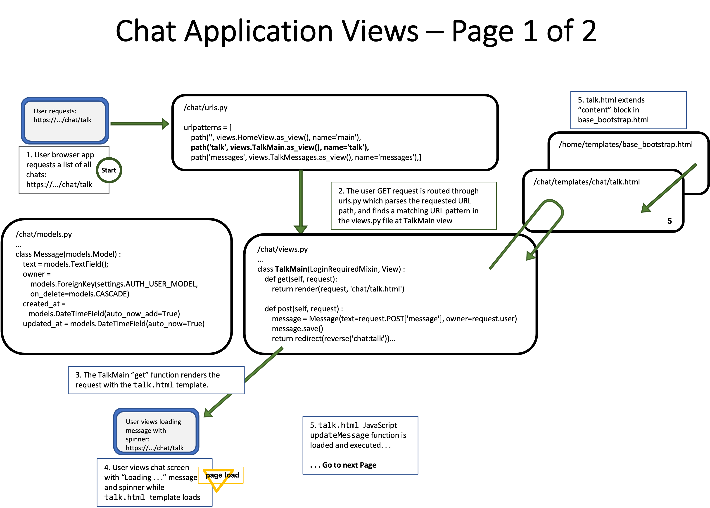

##### **Attribution:**  
- *This document contains my notes from the "Django for Everybody (DJ4E)" MOOC series created by Dr. Charles Severance, University of Michigan. The materials in the DJ4E courses are available under a Creative Commons License to allow for teachers to make use of these materials in their own courses.*  
- *The following notes contain images based on the DJ4E presentation slides, also created by Dr. Severance as course resources. The notes and images in this document were assembled by me as a learning aid to supplement the course content and as a reference for completing the course assignments and quizzes.*

*My notes represent my interpretation of the DJ4E course videos, transcripts and presentation slides.* ***Any content errors or omissions in these notes should be attributed to me, as the note-taker.***


# Django for Everybody

## Course #4: Using JavaScript, JQuery, and JSON in Django

### Week 4 - JSON / AJAX

#### JSON / AJAX Overview
- The document object model is a data structure that the browser maintains to manage what is presented to the user. It includes the entire document - both what is on screen and what is off screen.
- Once Javascript is loaded onto the page, it can intercept the user events like scrolling and clicking on elements and run code that directly interacts with the server to route, present views, and access the data model.
- Rather than present a whole new page, JavaScript allows you to manipulate part of the webpage.
- JSON is the data interchange format -- i.e., wire format - used by Javascript on the browser client to communicate with the web server. - The web server could be running python or some other language. Regardless, when data is sent over the network, it is in JSON. The client JavaScript code must serialize its data into JSON and transmit it across the network. The server must receive the data in JSON, de-serialize it, and then manipulate it in its native language. The same thing will happen in reverse when the server communicates to the client.
- AJAX stands for Asynchronous JavaScript And XML. It is a set of web development technologies used by JavaScript to transmit data over the network. The data does not have to be in XML format; AJAX can be used to transmit JSON or plain text format.
- JSON Syntax - client-side
    - It looks like Python dictionaries, lists and key-value pairs
    - Example:
        ```
        <script type="text/javascript">
        who = {
            "name": "Chuck",
            "age": 29,
            "college": true,
            "offices" : [ "3350DMC", "3437NQ" ],
            "skills" : { "fortran": 10, "C": 10,
                "C++": 5, "python" : 7 }
        };
        ```
      - In the example above, to access the number "10" in the "skills" dictionary using JSON syntax: `who.skills.C`.
      - Everything between the curly braces is JSON.
- JSON Syntax - server-side
    - Example:
        - `urls.py`:    
              `path('jsonfun', views.jsonfun, name= 'jsonfun')`
        - `views.py`:
          ```
          from django.http import JsonResponse
          ...
          def jsonfun(request):
              stuff = {
                  'first': 'first thing',
                  'second': 'second thing'
              }
              return JsonResponse(stuff)
          ```
            - `stuff` is a python dictionary, and the dictionary is in JSON.
            - it is convention in JSON that the outer wrapper be an object - in this case a dictionary. `stuff` could have been placed in a list, but it is best practice to wrap the list in a dictionary.
            - In the headers of a `JsonResponse`, `content-type = application/json`

#### Walkthrough: DJ4E JSON (chat) Sample Code

##### File Flow for Chat Application View (first of 2 images) with Polling through JQuery Script



##### File Flow for Chat Application View (second of 2 images) with Polling through JQuery Script


##### Chat Application File Excerpt From `talk.html` of JQuery Polling Script


##### Postscript attributions:

*The Django for Everybody course and slides are Copyright 2019-  Charles R. Severance (www.dr-chuck.com) as part of www.dj4e.com and made available under a Creative Commons Attribution 4.0 License.  Please maintain this postscript in all copies of the document to comply with the attribution requirements of the license.  If you make a change, feel free to add your name and organization to the list of contributors on this page as you republish the materials.*

*Initial Development: Charles Severance, University of Michigan School of Information*

*Insert new Contributors and Translators here including names and dates:*  
*Tim Castle, January 2022*
